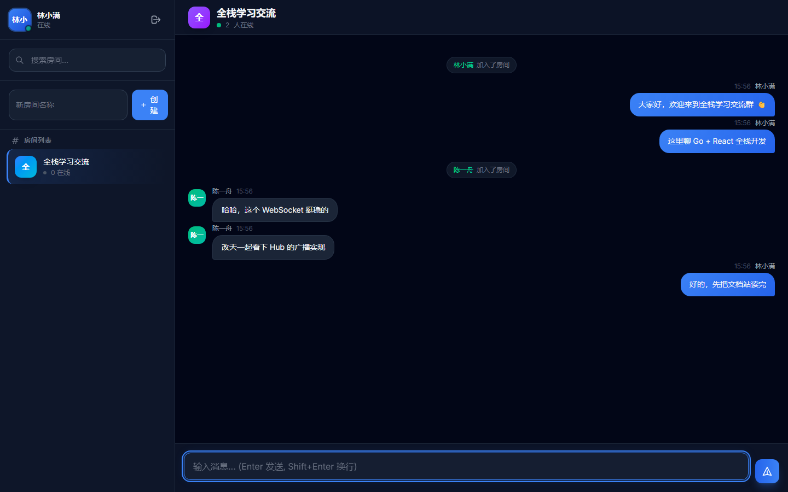

# ChatRoom

[](https://github.com/build-workbench/chatroom/actions/workflows/ci.yml)
[](https://build-workbench.github.io/chatroom/)
[](LICENSE)

一个个人业余练手的全栈项目，用 **Go + React + PostgreSQL + WebSocket** 实现一个轻量可运行的实时聊天室。

## 界面预览



*浅色精美主题：左侧房间列表与在线人数，右侧消息流与输入区 · 雾蓝留白、柔和阴影、圆角卡片，轻盈通透适合长时间阅读与演示*

## 快速开始

### 前置要求

- Go 1.24+
- Node.js 22+
- Docker

### 方式一：本地开发运行（推荐）

```bash
# 1. 启动 PostgreSQL 数据库
docker compose up -d postgres

# 2. 启动 Go 后端（监听 :8080）
go run ./cmd/server

# 3. 启动前端开发服务器（另开终端，监听 :5173）
npm --prefix frontend ci
npm --prefix frontend run dev
```

### 方式二：Docker 一键运行

无需本地安装 Go 和 Node.js 环境，直接构建并启动整套全栈服务：

```bash
docker compose up -d
```

启动后直接访问 `http://localhost:8080`。停止服务运行 `docker compose down`。

### 访问地址

| 服务 | 地址 | 说明 |
|------|------|------|
| 前端页面（本地开发） | http://localhost:5173 | 支持热更新，自动代理后端 API 与 WebSocket |
| 后端服务 / Docker 页面 | http://localhost:8080 | 提供 REST API、WebSocket 及生产静态文件 |
| 完整文档站 | https://build-workbench.github.io/chatroom/ | 架构设计、接口参考与实验指南 |

## 常用命令

```bash
# 测试
go test -race ./...              # 后端单元与集成测试（使用内存 SQLite）
npm --prefix frontend run test  # 前端测试

# 代码检查与打包
make lint                       # golangci-lint
npm --prefix frontend run build # 前端生产打包
```

## 文档与协议

- 📖 **[完整文档](https://build-workbench.github.io/chatroom/)**：包含架构设计、REST API、WebSocket 协议及详细实验指南。
- 📄 **[开源协议](LICENSE)**：MIT License
