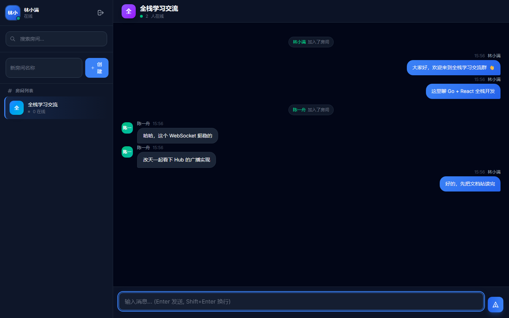

**English** | [中文](#chinese)

<a id="top"></a>

# ChatRoom

[](https://github.com/build-workbench/chatroom/actions/workflows/ci.yml)
[](https://build-workbench.github.io/chatroom/)
[](LICENSE)

A lightweight real-time chat room built with **Go + React + PostgreSQL + WebSocket**, used to practice wiring up the full-stack fundamentals.

## UI Preview



## Features

- **User authentication**: JWT dual-token rotation, bcrypt password hashing, and one-time WebSocket Ticket authentication handshake.
- **Real-time communication**: room-level broadcast based on Go Channels and Goroutines, with heartbeat keep-alive and slow-connection cleanup.
- **Presence awareness**: real-time room online user counts and debounced "user is typing" indicators.
- **Front-end interaction**: React 19 + TypeScript + Tailwind CSS, with a light card design and status feedback.
- **Out of the box**: the back-end tests ship with an in-memory SQLite database (no external database needed), and Docker Compose can bring up the full stack with one command.

## Tech Stack

- **Back end**: Go 1.24, Gin, GORM, Gorilla WebSocket
- **Front end**: React 19, TypeScript, Vite 7, Tailwind CSS v4
- **Storage**: PostgreSQL 16 (in-memory SQLite for tests)
- **Delivery**: Docker, Docker Compose

## Quick Start

### Prerequisites

- Go 1.24+
- Node.js 22+
- Docker

### Local development

```bash
# 1. 启动 PostgreSQL 数据库
docker compose up -d postgres

# 2. 启动 Go 后端（监听 :8080）
go run ./cmd/server

# 3. 启动前端（另开终端，监听 :5173）
npm --prefix frontend ci
npm --prefix frontend run dev
```

### Running with Docker

No need to configure local language toolchains; build and start the full-stack service with one command:

```bash
docker compose up -d
# 停止运行：docker compose down
```

### Access points

- Front-end page (local development): http://localhost:5173
- Back-end service / Docker page: http://localhost:8080
- Full documentation site: https://build-workbench.github.io/chatroom/

## Production deployment

The compose defaults are tuned for a local try-out. For a server exposed to the public internet, put an HTTPS reverse proxy in front and harden three variables in `.env` (copy from [`.env.example`](./.env.example)):

```bash
APP_ENV=production
JWT_SECRET=<generate: openssl rand -hex 32>   # the app refuses to boot with the default secret in production
ALLOWED_ORIGINS=https://chat.example.com      # exact origin(s) users visit; enforced on CORS + WebSocket origins (same-origin requests still pass via the Host check, but set this explicitly)
POSTGRES_PASSWORD=<a real password>           # also picked up by the app DSN automatically
```

Then `docker compose up -d` and terminate TLS in front of the published port (`${APP_PORT:-8080}`). The reverse proxy must forward WebSocket upgrades — both the handshake and messages go through the `/ws` upgrade request:

### Caddy

```caddy
chat.example.com {
    reverse_proxy 127.0.0.1:8080
}
```

### nginx

```nginx
server {
    listen 443 ssl http2;
    server_name chat.example.com;

    ssl_certificate     /etc/letsencrypt/live/chat.example.com/fullchain.pem;
    ssl_certificate_key /etc/letsencrypt/live/chat.example.com/privkey.pem;

    location / {
        proxy_pass http://127.0.0.1:8080;
        proxy_http_version 1.1;
        proxy_set_header Upgrade $http_upgrade;
        proxy_set_header Connection "upgrade";
        proxy_set_header Host $host;
        proxy_set_header X-Forwarded-Proto $scheme;
        proxy_read_timeout 86400s;   # long-lived WebSocket sessions
    }
}
```

Other tunables (token TTLs, WS message limits, DB pool sizes) are documented in [`.env.example`](./.env.example).

## Common commands

```bash
# 运行测试
go test -race ./...              # 后端测试
npm --prefix frontend run test  # 前端测试

# 代码检查与打包
make lint                       # 后端代码检查（golangci-lint）
npm --prefix frontend run build # 前端生产打包
```

## Protocol & Documentation

- [Full documentation site](https://build-workbench.github.io/chatroom/) (architecture design, API reference and testing experiments)
- [MIT License](LICENSE)

---

<a id="chinese"></a>
[English](#top) | **中文**

# ChatRoom

[](https://github.com/build-workbench/chatroom/actions/workflows/ci.yml)
[](https://build-workbench.github.io/chatroom/)
[](LICENSE)

基于 **Go + React + PostgreSQL + WebSocket** 实现的轻量实时聊天室，用于串联和练习全栈基础链路。

## 界面预览


## 功能特性

- **用户认证**：JWT 双 Token 轮换机制、密码 bcrypt 哈希、WebSocket 一次性 Ticket 认证握手。
- **实时通信**：基于 Go Channel 与 Goroutine 的房间级广播，支持心跳保活与慢连接清理。
- **状态感知**：房间在线人数实时统计、用户正在输入（Typing）去抖提示。
- **前端交互**：React 19 + TypeScript + Tailwind CSS，浅色卡片设计与状态反馈。
- **开箱即用**：后端测试自带 SQLite 内存库（免配外部数据库），支持 Docker Compose 一键拉起。

## 技术栈

- **后端**：Go 1.24, Gin, GORM, Gorilla WebSocket
- **前端**：React 19, TypeScript, Vite 7, Tailwind CSS v4
- **存储**：PostgreSQL 16（测试使用内置 SQLite 内存库）
- **交付**：Docker, Docker Compose

## 快速开始

### 前置要求

- Go 1.24+
- Node.js 22+
- Docker

### 本地开发

```bash
# 1. 启动 PostgreSQL 数据库
docker compose up -d postgres

# 2. 启动 Go 后端（监听 :8080）
go run ./cmd/server

# 3. 启动前端（另开终端，监听 :5173）
npm --prefix frontend ci
npm --prefix frontend run dev
```

### Docker 运行

无需配置本地语言环境，一键构建并启动全栈服务：

```bash
docker compose up -d
# 停止运行：docker compose down
```

### 访问入口

- 前端页面（本地开发）：http://localhost:5173
- 后端服务 / Docker 页面：http://localhost:8080
- 完整文档站：https://build-workbench.github.io/chatroom/

## 生产部署

Compose 默认配置面向本地体验。若要部署到公网，请在前面加一层 HTTPS 反向代理，并在 `.env`（从 [`.env.example`](./.env.example) 复制）中加固以下变量：

```bash
APP_ENV=production
JWT_SECRET=<生成方式：openssl rand -hex 32>   # 生产环境下使用默认密钥应用会拒绝启动
ALLOWED_ORIGINS=https://chat.example.com      # 用户实际访问的完整 origin，用于 CORS 与 WebSocket 来源校验（同源请求有 Host 兜底校验，但建议显式配置）
POSTGRES_PASSWORD=<真实密码>                  # 应用 DSN 会自动读取同一变量
```

然后 `docker compose up -d`，并在对外端口（`${APP_PORT:-8080}`）前面做 TLS 终结。反向代理必须转发 WebSocket 升级——握手与消息都走 `/ws` 这个升级请求：

### Caddy

```caddy
chat.example.com {
    reverse_proxy 127.0.0.1:8080
}
```

### nginx

```nginx
server {
    listen 443 ssl http2;
    server_name chat.example.com;

    ssl_certificate     /etc/letsencrypt/live/chat.example.com/fullchain.pem;
    ssl_certificate_key /etc/letsencrypt/live/chat.example.com/privkey.pem;

    location / {
        proxy_pass http://127.0.0.1:8080;
        proxy_http_version 1.1;
        proxy_set_header Upgrade $http_upgrade;
        proxy_set_header Connection "upgrade";
        proxy_set_header Host $host;
        proxy_set_header X-Forwarded-Proto $scheme;
        proxy_read_timeout 86400s;   # WebSocket 长连接
    }
}
```

其余可调项（Token 有效期、WS 消息上限、连接池大小等）见 [`.env.example`](./.env.example)。

## 常用命令

```bash
# 运行测试
go test -race ./...              # 后端测试
npm --prefix frontend run test  # 前端测试

# 代码检查与打包
make lint                       # 后端代码检查（golangci-lint）
npm --prefix frontend run build # 前端生产打包
```

## 协议与文档

- [完整文档站](https://build-workbench.github.io/chatroom/)（架构设计、API 参考与测试实验）
- [MIT License](LICENSE)
