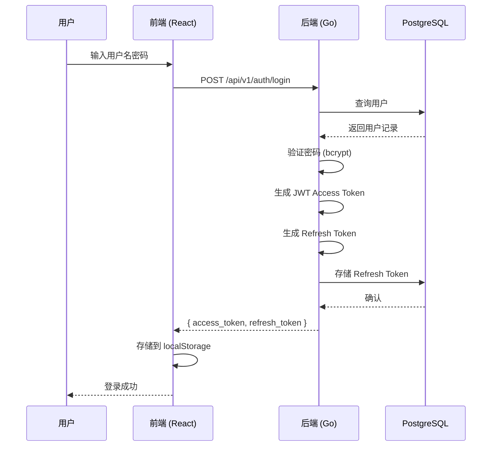
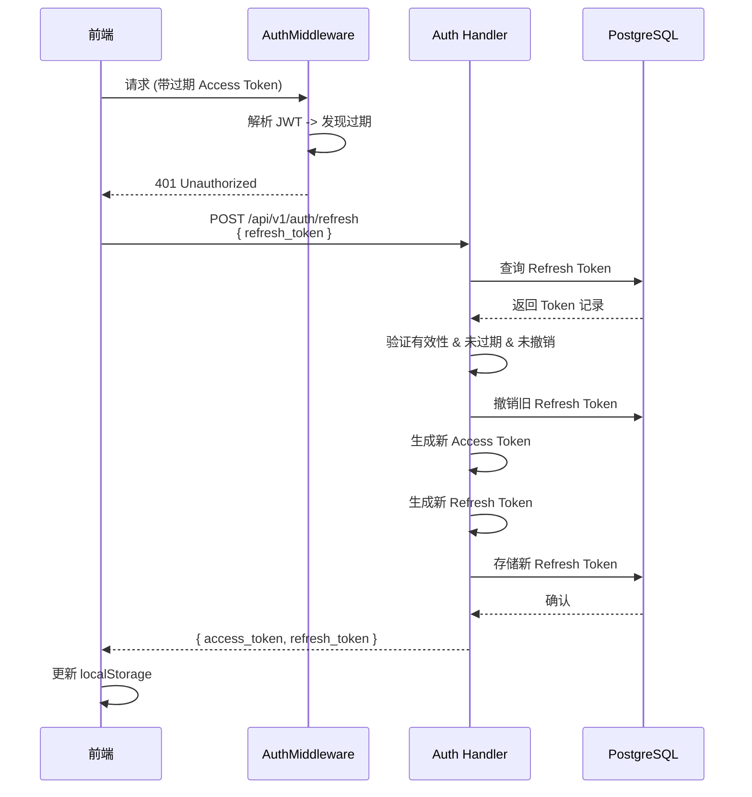
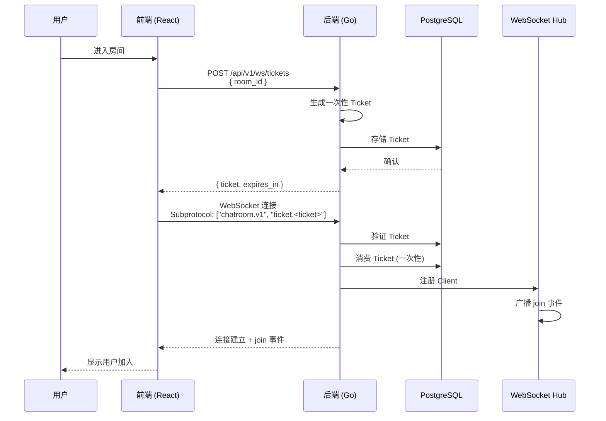
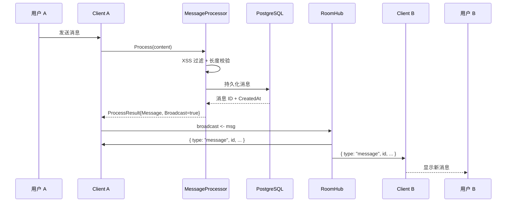
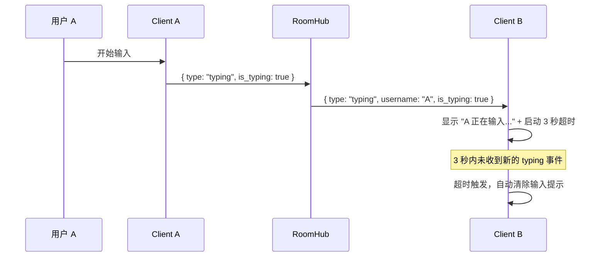

# 数据流

本文档分析 ChatRoom 中关键数据的流转路径。

## 认证流程

## Token 刷新流程

## WebSocket 连接流程

## 消息流转

## 输入状态流

> **设计说明**：发送方只发 `is_typing: true`，不发送 `false`。接收方为每个用户维护一个 3 秒定时器，超时后自动清除输入提示。这简化了发送方的逻辑，代价是接收方需要管理定时器。

---
