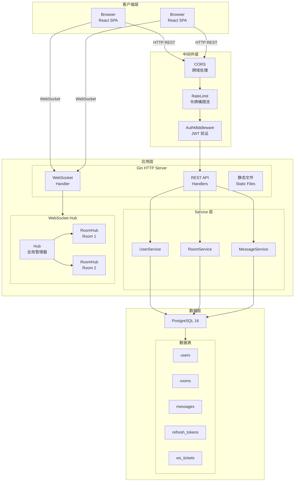
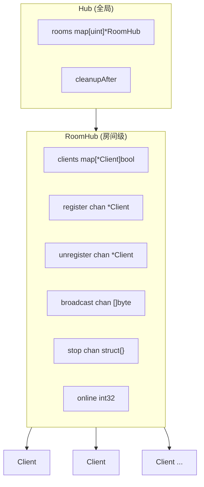

# 系统架构

## 系统概览

ChatRoom 是一个实时聊天室应用，采用前后端分离架构，支持 WebSocket 实时通信。项目专为教学设计，强调代码可读性和工程化实践。

这是一个**单实例**教学项目：不涉及多副本部署、分布式会话同步或监控体系。架构刻意保持简单，便于阅读和讲解。

## 技术栈

| 层级 | 技术选型 |
|------|----------|
| 后端 | Go 1.24, Gin, GORM, Gorilla WebSocket, zerolog |
| 前端 | React 19, TypeScript, Vite 7, Tailwind CSS v4 |
| 数据库 | PostgreSQL 16 |
| 部署 | Docker, GitHub Actions |

## 目录结构

```text
chatroom/
├── cmd/server/              # 程序入口
│   └── main.go              # 启动、配置、优雅停服
├── internal/                # 内部包（不可被外部导入）
│   ├── auth/                # JWT、密码哈希、WebSocket 票据
│   ├── config/              # 配置加载、校验、日志初始化
│   ├── db/                  # 数据库连接、迁移、清理
│   ├── models/              # GORM 数据模型
│   ├── sanitize/            # 用户输入清洗（防 XSS）
│   ├── server/              # HTTP 路由、Handler、中间件（认证/限流/CORS）
│   ├── service/             # 业务逻辑层
│   └── ws/                  # WebSocket Hub、连接、消息处理
├── frontend/                # React 主前端
│   └── src/
│       ├── components/      # UI 组件
│       ├── hooks/           # 自定义 Hooks
│       ├── screens/         # 页面组件
│       └── *.ts             # API、Socket、Storage 等
├── docs/                    # VitePress 文档站
└── deploy/                  # 部署配置
    └── docker/              # Dockerfile
```

## 整体架构



## 模块详解

### cmd/server

程序入口点，职责：

1. **配置加载**：调用 `config.Load()` 从环境变量读取配置
2. **日志初始化**：调用 `config.InitLog()` 配置 zerolog
3. **配置校验**：调用 `config.Validate()` 确保必要参数有效
4. **数据库连接**：调用 `db.Connect()` 建立连接池
5. **数据库迁移**：调用 `db.Migrate()` 自动迁移表结构
6. **启动清理任务**：调用 `db.StartCleanup()` 定期清理过期 token 和 ticket
7. **创建 Hub**：调用 `ws.NewHub()` 创建 WebSocket 管理器
8. **构建路由**：调用 `server.SetupRouter()` 创建 Gin 引擎
9. **启动 HTTP 服务**：在独立 goroutine 中监听请求
10. **优雅停服**：捕获信号，依次关闭 Hub、清理任务、HTTP 服务、数据库连接

### internal/config

配置管理与日志初始化模块：

```go
type Config struct {
    Port                  string   // HTTP 监听端口
    DatabaseDSN           string   // 数据库连接串
    JWTSecret             string   // JWT 签名密钥
    Env                   string   // 运行环境 (dev/staging/production)
    LogLevel              string   // 日志级别
    LogFormat             string   // 日志格式 (console/json)
    AccessTokenTTLMinutes int      // Access Token 有效期
    RefreshTokenTTLDays   int      // Refresh Token 有效期
    WSTicketTTLSeconds    int      // WebSocket Ticket 有效期
    AllowedOrigins        []string // CORS 允许的来源列表
    WsMaxMessageSize      int64    // WebSocket 消息大小上限
    WsMaxContentSize      int      // 单条消息字符上限
    DBMaxIdleConns        int      // 连接池空闲连接数
    DBMaxOpenConns        int      // 连接池最大打开连接数
}
```

`InitLog(cfg)` 根据配置初始化 zerolog：开发环境输出易读的控制台格式，生产环境输出 JSON。

### internal/auth

认证与授权模块：

| 函数 | 用途 |
|------|------|
| `HashPassword` | 使用 bcrypt 哈希密码 |
| `VerifyPassword` | 验证密码与哈希是否匹配 |
| `GenerateAccessToken` | 签发 JWT Access Token |
| `ParseAccessToken` | 解析并验证 JWT |
| `GenerateRefreshToken` | 生成随机 Refresh Token |
| `SaveRefreshToken` | 保存 Refresh Token 到数据库 |
| `ValidateRefreshToken` | 验证 Refresh Token 有效性 |
| `RevokeRefreshToken` | 撤销 Refresh Token |
| `GenerateAndStoreWSTicket` | 生成并存储 WebSocket Ticket |
| `ValidateAndConsumeWSTicket` | 验证并一次性消费 WebSocket Ticket |

### internal/server

HTTP 服务层，包含路由、Handler 和中间件（认证、限流、CORS）：

```
Handler ──依赖──> Service 接口 ──实现──> Service 结构体 ──依赖──> *gorm.DB
```

**路由设计**：

```
/health      GET  健康检查
/healthz     GET  健康检查（简洁）
/ready       GET  就绪检查（含数据库连通性）
/version     GET  版本信息

/api/v1/auth/register    POST   用户注册
/api/v1/auth/login       POST   用户登录
/api/v1/auth/refresh     POST   刷新令牌

/api/v1/rooms            GET    房间列表
/api/v1/rooms            POST   创建房间
/api/v1/rooms/:id/messages  GET 获取消息

/api/v1/ws/tickets       POST   获取 WS Ticket

/ws                      GET    WebSocket 连接
```

### internal/ws

WebSocket 核心模块：



每个 `RoomHub` 是一个独立 goroutine，通过 register/unregister/broadcast 三个 channel 管理房间内的客户端。在线人数由 `Hub.Online(roomID)` 直接从内存统计，无需查数据库。

---

## 安全设计

### 认证与授权

| 机制 | 说明 |
|------|------|
| JWT Access Token | 短期有效（默认 15 分钟），用于 API 认证 |
| Refresh Token | 长期有效（默认 7 天），存储于数据库，支持轮换 |
| WebSocket Ticket | 一次性票据（默认 60 秒有效），通过 Subprotocol 传递，防止 Token 泄露 |

### 防护措施

| 措施 | 实现位置 |
|------|----------|
| 密码哈希 | bcrypt，DefaultCost |
| 速率限制 | IP + 路径维度，令牌桶算法 |
| CORS 校验 | 严格 origin 白名单 |
| 输入验证 | 所有请求参数校验 |
| 消息长度限制 | 单条消息最大 2000 字符 |
| WebSocket 消息大小限制 | 最大 1 MB |
| XSS 防护 | 用户名白名单 + 消息内容 HTML 转义 |

---
