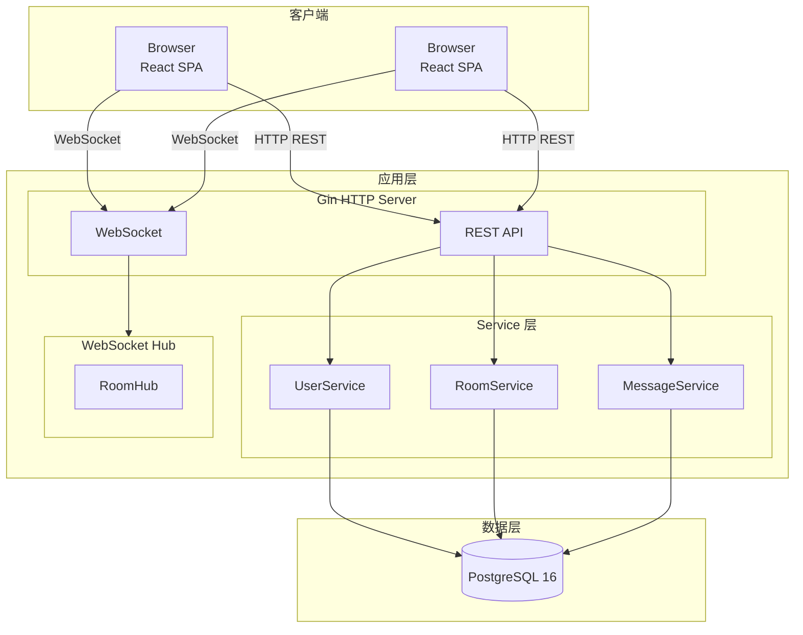

# ChatRoom

> 一个面向教学的实时聊天室：Go + React + PostgreSQL + WebSocket

展示如何把认证、房间、消息、WebSocket 组合成一个可运行、可理解的全栈系统

## 核心特性

- **JWT 双 Token 认证**：短期 Access Token + 长期 Refresh Token，自动轮换
- **WebSocket Ticket 认证**：一次性票据，通过 Subprotocol 传递，防止重放
- **房间级实时广播**：每个房间一个 RoomHub goroutine，连接与消息隔离
- **消息持久化**：聊天记录存入 PostgreSQL，支持分页加载历史

## 快速导航

  <a href="/tutorials/local-dev" class="nav-card primary">
    
🚀

    
快速开始

    
几分钟内启动项目

  </a>
  <a href="/architecture/system" class="nav-card">
    
🏗️

    
系统架构

    
分层与组件交互

  </a>
  <a href="/api/rest" class="nav-card">
    
🔌

    
API 参考

    
REST 与 WebSocket 协议

  </a>

## 架构预览

